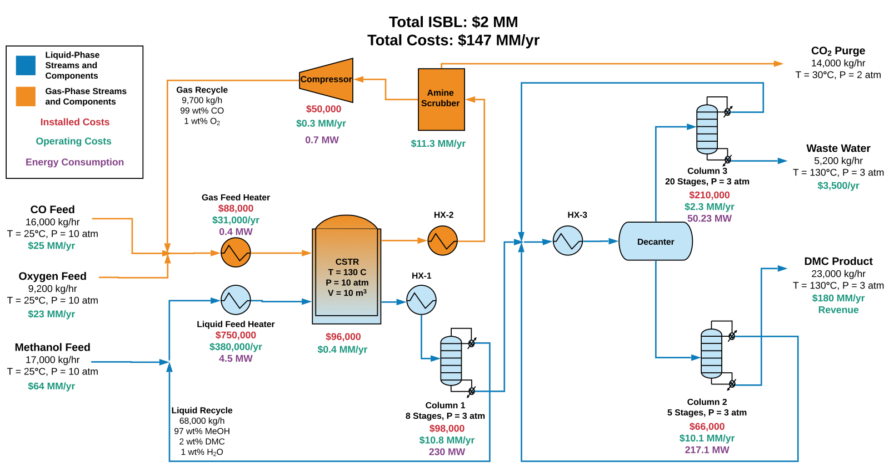

# Non-Phosgene Route for the Production of Dimethyl Carbonate: Plant Design and Economic Analysis
 
_Authors: Robert Davison, Aaron Veronese, Jaehun Chung_

---

## Executive Summary
---
This report presents a preliminary design for a plant capable of producing 200 kilotons annually (KTA) of dimethyl carbonate (DMC), with a composition of 99.8 wt% DMC. DMC is a valuable precursor for polycarbonate production and can be sold for $900 per metric ton (MT). This design offers value as a green, less toxic route for polycarbonate production by avoiding the use of phosgene. 

In this process, DMC is generated through catalytic oxidative carbonylation of methanol with oxygen and carbon monoxide.  The reaction is carried out in a three-phase continuously stirred tank reactor (CSTR) with copper chloride as a heterogeneous solid catalyst. According to the reaction kinetics and various economic evaluations, the optimal reaction conditions were determined to be 130 °C and 10 atm with a molar ratio (MR1) of 10 moles of methanol to 1 mole of oxygen, and a molar ratio (MR2) of 2.85 moles of carbon monoxide to 1 mole of oxygen. Our design uses the optimal temperature and pressure conditions, but MR1 and MR2 were set to 9.0 and 3.2, respectively, to satisfy the constraints of the separations system. 

Pure liquid methanol is purchased for $450 per MT at standard conditions and fed to the system at a rate of 140 million (MM) kg per year. Pure high-pressure oxygen gas is purchased for $300 per MT and fed at a rate of 77 MM kg per year. Pure carbon monoxide gas costs $180 per MT and has a feed rate of 130 MM kg per year. Subsequent purification of DMC is achieved using three multi-stage, heavy duty distillation columns. 

After accounting for all components of the design, we estimate that each kg of DMC produced requires 76 MJ of energy input. The proposed design will require a 2-year construction period with a total capital investment (TCI) of $43 MM, which is financed by a 10-year bond at a fixed rate of 4%. After 12 years of operation, the plant is predicted to have a net present value (NPV) of $46.6 MM and an NPV% of 7.8% per year. We believe that this design satisfies the profitability requirements of the company, and that its economic potential merits further investigation into DMC plant commissioning. 

---

## Process Flow Diagram

**Figure 1.** Process flow diagram for the continuous production and distillation of dimethyl carbonate at 200 million kg/yr via the oxidative carbonylation of methanol.

